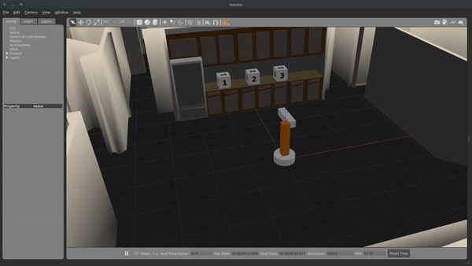

[](https://www.udacity.com/robotics)

# Simple-Arm
Part of Udacity nanodegree program called Robotics Software Engineer. In this project we will move a simple 2-DoF robotic arm.

## Creating workspace
If you don't have a catkin workspace, use the following steps to create a catkin workspace. Replace ros_dist with the ROS distribution you have example kinetic, melodic, etc.
```
mkdir -p ~/catkin_ws/src
cd ~/catkin_ws/src
git clone https://github.com/Chinj17/Simple-Arm.git
cd ..
source /opt/ros/ros_dist/setup.bash
catkin_make
source devel/setup.bash
```

If you already have a catkin workspace:
```
cd <path to your catkin workspace>
source devel/setup.bash
cd src/
git clone https://github.com/Chinj17/Simple-Arm.git
cd ..
catkin_make
```
Check and install any missing ROS dependencies.
```
rosdep install -i simple_arm
```

## Simple Mover
This node makes the arms move from [-pi/2, pi/2]. Open two terminal window and do the following:

**Terminal 1**
```
cd <path to your catkin workspace>
source devel/setup.bash
roslaunch simple_arm robot_spawn.launch
```

**Terminal 2**
```
cd <path to your catkin workspace>
source devel/setup.bash
rosrun simple_arm simple_mover
```


